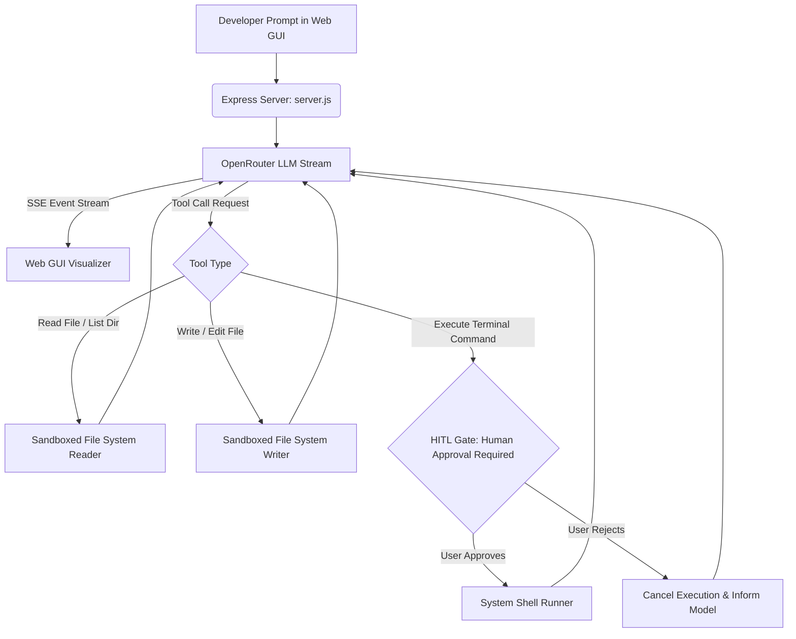

# 💻 AI Coding Agent — Autonomous Sovereign Dev Agent

<div align="center">

[](LICENSE)
[](https://nodejs.org/)
[](https://github.com/Kamran5H/AI-Coding)
[](https://github.com/Kamran5H/AI-Coding)
[](https://openrouter.ai/)

**Local, autonomous coding assistant featuring a real-time SSE streaming visualizer, sandboxed directory protection, and mandatory Human-in-the-Loop terminal safety gates.**

[Features](#-key-features) • [Safety Architecture](#-safety-first-architecture) • [Quickstart](#-quick-start) • [Configuration](#-configuration) • [License](#-license)

</div>

---

## 🌟 Executive Overview

**AI-Coding** is a sovereign, local developer agent engineered in JavaScript and Node.js. It bridges the gap between cloud LLMs and your local filesystem, allowing the agent to read directories, inspect source code, generate new modules, and refactor existing files while keeping the human developer strictly in control of terminal execution.

With zero cloud lock-in, AI-Coding integrates seamlessly with **OpenRouter**, allowing developers to swap between Claude 3.5 Sonnet, DeepSeek V3, Qwen 2.5 Coder, and GPT-4o with a single environment variable.

---

## 🚀 Key Features

- **⚡ Autonomous Agentic Loop**: The agent plans steps, reads repository files, writes changes, and iterates until the feature or bugfix is resolved.
- **🛡️ Human-in-the-Loop (HITL) Safety Gate**: Any system command (shell, terminal, package installations) triggers an explicit confirmation prompt. Nothing executes on your OS without your approval.
- **🌊 Real-Time SSE Event Stream**: Live Server-Sent Events (SSE) stream the agent's thought process, tool calls, file diffs, and execution status card-by-card in real time.
- **🔒 Sandboxed Workspace Directory**: Configurable root directory boundaries prevent the agent from reading or modifying files outside the designated project workspace.
- **🎨 Sleek Dark-Mode Web GUI**: Built with Vanilla JS and high-performance CSS, the interface provides syntax-highlighted code blocks, expandable tool outputs, and one-click commands.
- **🚀 One-Click Windows Launchers**: Includes `start-app.cmd`, `start-agent.cmd`, and `start_app.vbs` for instantaneous initialization.

---

## 🏗️ Safety-First Architecture



---

## 📁 Repository Structure

```text
AI-Coding/
├── server.js                   # Express server, agentic loop & tool dispatcher
├── public/                     # Frontend web GUI, SSE handlers & styling
├── HOW-TO-USE.md               # In-depth operator manual and workflow guide
├── start-app.cmd               # Quick launcher for Node.js backend
├── start-agent.cmd             # Dedicated CLI agent initiator
├── start_app.vbs               # Silent Windows launcher
├── package.json                # Project dependencies and npm scripts
├── .gitignore                  # Node modules and environment exclusions
└── LICENSE                     # Open-source MIT License
```

---

## ⚡ Quick Start

### Prerequisites
- Node.js 18.0+ or higher
- An OpenRouter API Key

### Setup
```bash
git clone https://github.com/Kamran5H/AI-Coding.git
cd AI-Coding

# Install dependencies
npm install
```

### Configuration
Create a `.env` file in the root directory:
```dotenv
OPENROUTER_API_KEY=sk-or-v1-xxxxxxxxxxxxxxxxxxxxxxxxxxxx
MODEL=anthropic/claude-3.5-sonnet  # or deepseek/deepseek-chat, qwen/qwen-2.5-coder-32b-instruct
PORT=3000
```

### Launch
```bash
# Start backend server & web GUI
npm start

# Or double-click start-app.cmd on Windows
```
Open [http://localhost:3000](http://localhost:3000) in your browser to start pair programming with your local agent!

---

## 📜 License

This project is open-source and released under the [MIT License](LICENSE).  
Copyright (c) 2024-2026 **Kamran Ashraf**.
